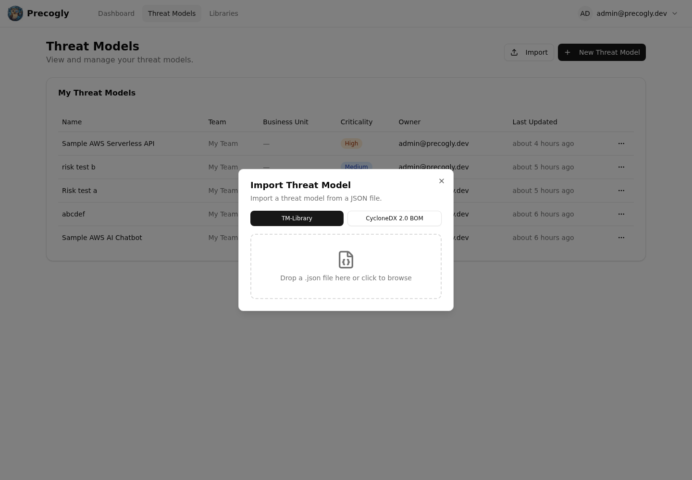

# Threat Model as Code

Precogly lets you export a threat model as structured JSON so you can store it in
version control, review changes, and integrate threat modeling into development
workflows. Precogly supports two import and export formats:

- **TM-Library v1.0** — Precogly's native interchange format and the best choice for
  moving complete models between Precogly installations.
- **CycloneDX 2.0 TM-BOM** — an industry-standard format for exchanging threat-model
  data with the wider CycloneDX ecosystem.

## Exporting

From any threat model workspace, open **Export** and select either **TM-Library
(JSON)** or **CycloneDX (JSON)**. TM-Library downloads use a name such as
`my-api-threat-model.json`; CycloneDX downloads use a name such as
`my-api-cyclonedx-tm-bom.json`.


TM-Library represents Precogly's complete model most directly, including:

- **Scope** — name, description, business criticality
- **Trust zones and boundaries** — with access control and authentication configuration
- **Actors, components, and data stores** — with trust zone assignments and parent relationships
- **Data assets** — sensitivity classifications and placements
- **Data flows** — source, destination, protocol, encryption status
- **Threat personas** — skill level, intent, resources, objectives
- **Threat sources** — linked NIST SP 800-30r1 source categories per threat
- **Threats** — with taxonomy references (STRIDE, CAPEC, CWE, ATT&CK), severity (inherent and residual), and persona/source associations
- **Controls** — status, priority, and linked threats
- **Risks** — likelihood, impact, and score
- **Assumptions** — with validity status
- **Extensions** — Precogly-specific data (severity scoring metadata, STRIDE/ATT&CK taxonomy, compliance mappings, pack lineage)

## Importing

On the Threat Models list page, click **Import**, select **TM-Library** or **CycloneDX**,
and drag in the corresponding JSON file (or use the file picker). Precogly creates a new
threat model from the entities and relationships it can map.



After import, review the summary of created trust zones, components, threats, controls,
and other records. The summary also reports references or values that could not be
resolved exactly.

## TM-Library JSON

The [OWASP Threat Model Library](https://github.com/OWASP/www-project-threat-model-library)
format is a structured JSON schema for threat-model interchange. Its top-level structure
looks like this:

```json
{
  "version": "1.0",
  "scope": {
    "title": "My API Platform",
    "description": "Public-facing REST API with OAuth2",
    "business_criticality": "high"
  },
  "trust_zones": [...],
  "trust_boundaries": [...],
  "actors": [...],
  "components": [...],
  "data_stores": [...],
  "data_sets": [...],
  "data_flows": [...],
  "threat_personas": [...],
  "threats": [...],
  "controls": [...],
  "risks": [...],
  "assumptions": [...],
  "extensions": { ... }
}
```

Entities use a `symbolic_name` (a stable identifier such as `comp_api_gateway`) to
preserve cross-references across import and export. When editing exported JSON manually,
keep these identifiers unique and update every reference to a renamed identifier.

## CycloneDX 2.0 TM-BOM

CycloneDX represents a threat model using BOM metadata, components, services,
vulnerabilities, compositions, and formulation blueprints. Precogly maps its entities to
those structures and uses BOM references to retain relationships.

Use CycloneDX when another tool consumes or produces CycloneDX BOMs. Use TM-Library when
the destination is another Precogly installation or when you need Precogly-specific
entities represented as directly as possible.

See [Importing and Exporting](../guides/importing-exporting.md) for the entity mapping,
validation rules, filenames, and current format limitations.

## Round-trip fidelity

Precogly stores core TM-Library entities—such as threat personas, threat sources,
severity values, and CAPEC/CWE references—as first-class records. Supported source fields
that do not map directly to the database can be retained in `format_metadata` and emitted
on export.

Precogly-specific analytical data can be carried in extension fields, including
STRIDE/ATT&CK mappings, scoring metadata, compliance mappings, and pack lineage. Always
review the import summary and compare a re-export when exact fidelity is required,
especially when exchanging data with a different tool.

## Version control workflows

Because the export is a single, human-readable JSON file, it fits naturally into existing development workflows:

- **Git history** — commit your threat model alongside code to track how the security analysis evolves with the architecture
- **Pull request reviews** — diff the JSON to review what changed in the threat model before merging
- **Audit trail** — tag releases with a snapshot of the threat model for compliance evidence
- **Templates** — export a well-structured threat model and import it as a starting point for similar projects

## Interoperability

Precogly's adapter architecture currently provides TM-Library v1.0 and CycloneDX 2.0
TM-BOM adapters. Both use the same live threat-model records, while each adapter maps
those records to the vocabulary and relationship model of its target format.

## Sample files

The repository includes ready-to-import sample threat models from the [OWASP Threat Model Library](https://github.com/OWASP/www-project-threat-model-library) project under [`docs/import-export-formats/Project-TM-Library/`](https://github.com/precogly/precogly/tree/main/docs/import-export-formats/Project-TM-Library):

| File | Description |
|------|-------------|
| `husky-ai-threat-model.json` | ML pipeline with data ingestion, training, and inference |
| `hashicorp-vault-threat-model.json` | Secrets management infrastructure |
| `cryptocurrency-wallet-threat-model.json` | Crypto wallet with key management and transaction signing |
| `ephemeral-browser-isolation-threat-model.json` | Browser isolation platform with session management |
| `kata-containers-threat-model.json` | Container virtualisation isolation layer with threat personas and source references |

Import any of these to explore a fully populated threat model with components, threats, controls, and risks.
