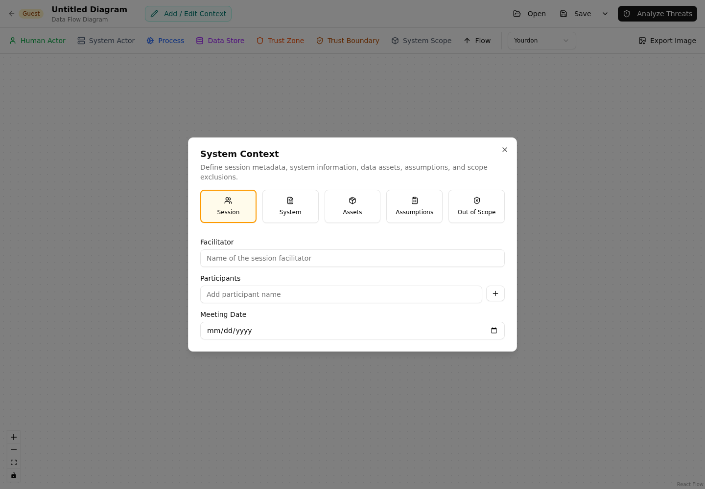

# Guest Editor

The guest editor provides a local, account-free threat-modeling workflow at
[`/guest`](http://localhost:5173/guest). You can define context, draw a DFD, record
threats and countermeasures, and save the model as CycloneDX 2.0 JSON.

!!! warning "Save your work"
    Guest models are not stored in Precogly's database. Use **Save** or **Save As**
    before closing the tab or navigating away.

## Start a guest model

Open `/guest` on your Precogly installation. Click the model title to rename it, then use
**Add / Edit Context** to record:

- Session facilitator, participants, and meeting date
- System description and business criticality
- Data assets, classifications, and CIA ratings
- Assumptions and their validity
- Explicit out-of-scope items

This context is included in the saved CycloneDX file and the guest Word report.

## Draw the data flow diagram

Use the toolbar to add processes, data stores, human and system actors, trust zones, and
system-scope containers. Connect nodes with data flows and edit each item in the side
panel.

The notation selector switches between **DFD3** and **Yourdon** shapes. The model's
notation is retained when you save and reopen the CycloneDX file.

See [DFD Editor](../concepts/dfd-editor.md) for the shared canvas concepts and keyboard
shortcuts. Features that depend on an organization, library packs, or backend records are
available only in the signed-in workspace.

## Add threats and countermeasures

Click **Analyze Threats** to open the three-column guest analysis view:

1. Select a component, system scope, or data flow.
2. Add a threat with a name, description, severity, optional STRIDE category, and status.
3. Record a decision rationale when accepting, delegating, or eliminating a threat.
4. For threats marked **Mitigate**, add one or more countermeasures and select their
   control types.

You can sort threats by status, severity, or name and return to the diagram at any time.
Deleting a threat also removes its guest countermeasures.

## Save and reopen files

Guest files use the `.cdx.json` extension and contain a CycloneDX 2.0 Threat Modeling
BOM.

- **Save** writes to the currently opened file when the browser supports the File System
  Access API. The first save prompts for a location.
- **Save As** always prompts for a new filename.
- **Open** loads a previously saved guest CycloneDX file.
- **Cmd/Ctrl+S** performs the same action as **Save**.

Browsers without the File System Access API download a new `.cdx.json` file on save and
use a file picker when opening a model. Keep the most recent download as the current copy.

## Export and report

The diagram toolbar can export the canvas as PNG or SVG. From **Analyze Threats**, click
**Report** to download a Word document containing the system context, DFD image, threats,
and countermeasures.

The guest report and file are point-in-time exports. Update and save them again after
changing the model.

## Guest and signed-in workflows

Guest mode is useful for workshops, evaluations, and local modeling without account
setup. Use the signed-in workspace when you need organization libraries, collaboration,
ownership, compliance mappings, risk tracking, or server-side persistence.

For interchange details, see [Importing and Exporting](importing-exporting.md).
