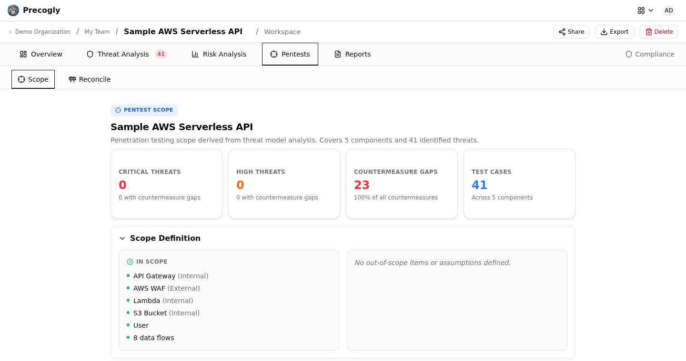

# Pentest Scope

The **Pentests** workspace turns an existing threat model into a structured penetration
testing scope. It derives components, test cases, priorities, assets, compliance context,
and risk links from the same report data used elsewhere in the threat model.

## Open the workspace

Open a threat model and select **Pentests**, then select the **Scope** sub-tab. Populate
the system context, DFD, threats, data assets, compliance frameworks, and risks first; an
incomplete threat model produces a correspondingly limited pentest scope.

The scope is generated from current threat-model data. It is a read-only planning view
and does not create verification tests or pentest findings by itself.

## Scope contents

### Summary metrics

The header summarizes the number of components, trust zones, test cases, critical tests,
data assets, and linked compliance requirements.

### Scope definition

The scope section carries forward the system description, business criticality,
out-of-scope items, and assumptions. Review these before handing the scope to a tester so
the engagement boundaries are explicit.

### Data assets at risk

Each data asset includes its classification and confidentiality, integrity, and
availability ratings. Placements show which components hold the asset and whether it is
encrypted. Transit gaps highlight unencrypted data flows.

### Attack surface map

Components are grouped by trust zone. Their associated threat counts and severities help
testers understand which parts of the architecture deserve the most attention.

### Testing priorities

Threats are grouped by inherent severity to form Critical, High, Medium, and Low testing
priorities. This preserves the threat model's prioritization rather than inventing a
separate pentest score.

### Test cases by component

Every active threat becomes a proposed test case under its component or data flow. The
entry includes the threat description, STRIDE category, inherent severity, current
status, and relevant countermeasures.

### Compliance requirements

Linked frameworks and requirements show where testing may provide compliance evidence.
The scope reflects the mappings currently present on the threat model; it does not assert
that a test alone satisfies a requirement.

### Risk cross-reference

Linked risk-register entries connect technical test cases to business risk. Use this
section to explain why a finding matters and who owns the resulting response.

## Keep the scope current

The view is recalculated from live threat-model data when it loads. Update the underlying
model when scope or priorities are wrong, then return to **Pentests** to review the
result. Avoid maintaining a second, conflicting source of truth outside the threat model.

## Reconcile findings

The **Reconcile** sub-tab is currently a placeholder for comparing pentest findings with
modeled threats and countermeasures. Finding reconciliation is not yet available through
this workspace.

For the upstream analysis that feeds this view, see [Creating a Threat Model](creating-threat-model.md)
and [Threat Analysis](../concepts/threat-analysis.md).
